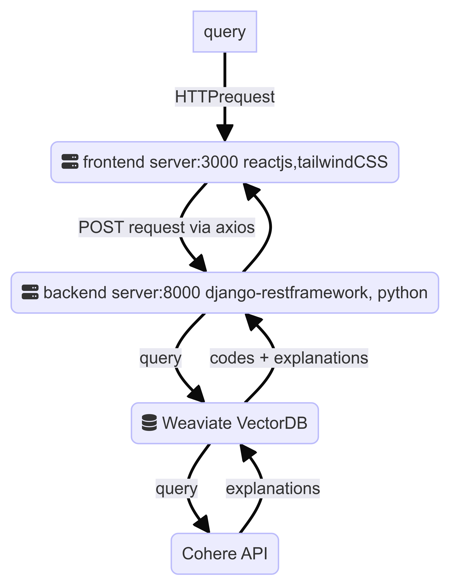
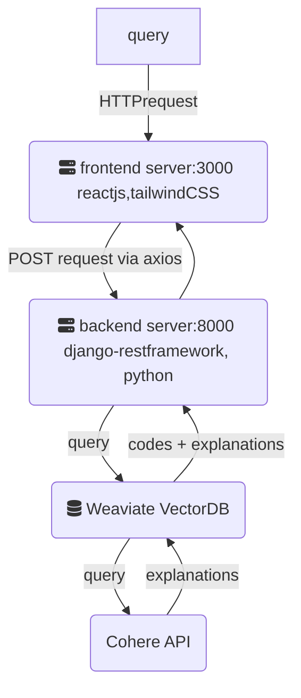
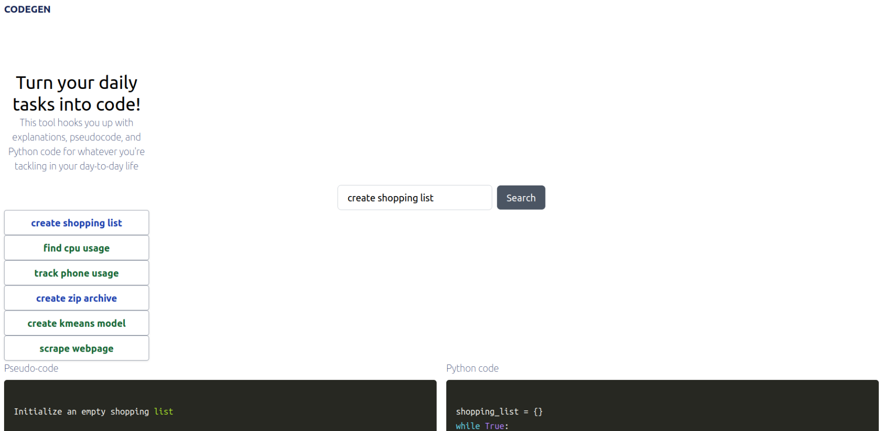
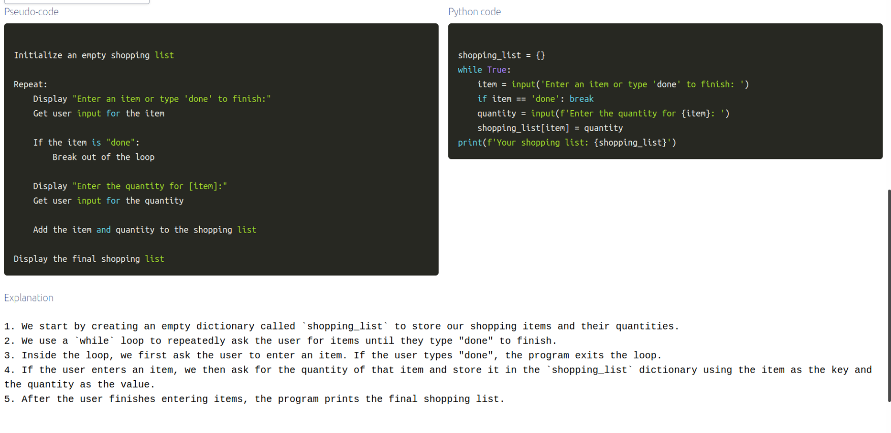

# Weaviate MLE Challenges Repository

This repository contains the codes for the Weaviate MLE challenges 1, 2.1, and 2.2:

## 1. **Weaviate Workflow**
- **Notebook**: `CODEGEN_Weaviate_workflow.ipynb`
- **Description**: This notebook contains the Weaviate workflow for CODEGEN-RAG, involving the processing of the dataset and populating the Weaviate database.

## 2.1 **CODEGEN-RAG**
- **Description**: A full-stack RAG project for generating Python codes and explanations using vector search and generative search.
- **Dataset**: [python-codes-25k](https://huggingface.co/datasets/flytech/python-codes-25k)

## 2.2 **LinkedIn ML Pipeline**
- **Description**: The analytics pipeline for challenge 2.2 based on the Kaggle dataset.
- **Dataset**: [LinkedIn Job Postings](https://www.kaggle.com/datasets/arshkon/linkedin-job-postings)

## More Details on 2.1

### 2.1 **CODEGEN-RAG**

This is a RAG implementation, involving vector search for task-based 'python codes' from the vector database and the generative search of explanations and pseudocodes for the obtained codes using Cohere API.

Flow diagram for CODEGEN-RAG:

#### Vector Search Implementation

The vector search is done by initially populating the Weaviate vector database running on a sandbox instance on Weaviate Cloud (WCD). You can find more information and get started with Weaviate using the following link: [Weaviate Quickstart](https://weaviate.io/developers/weaviate/quickstart).

The data used for this is modulated from the `flytech/python-codes-25k` database, which is available on Hugging Face: [flytech/python-codes-25k](https://huggingface.co/datasets/flytech/python-codes-25k).

#### RAG Implementation

For the RAG implementation, the Cohere-based Generative Search module is used. You can find more information [here](https://weaviate.io/developers/weaviate/modules/reader-generator-modules/generative-cohere).

The project includes `backend` and `frontend` folders. The backend relies on Python and Django Rest Framework. The frontend is based on React.js, Tailwind CSS, and Axios as the mediator between the frontend and backend parts. In addition, Prism.js is used for syntax highlighting Python code outputs in the webpage.

Frontend UI screenshots

