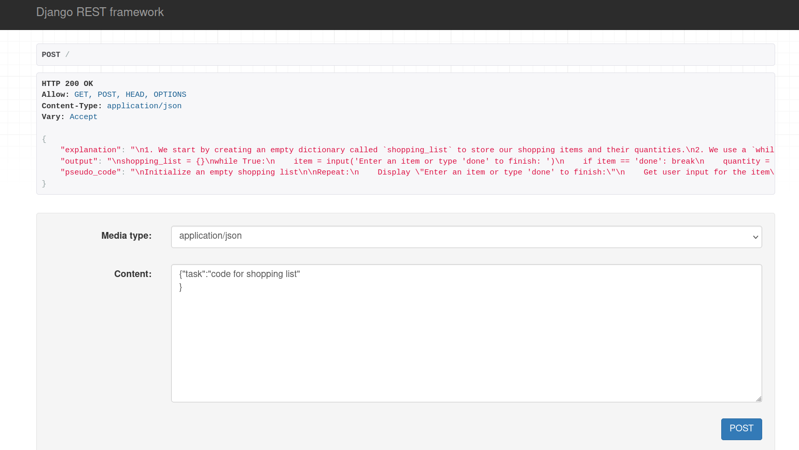

**Test django server on port 8000**

input: json 

***sample***:
{"task":"code for shopping list"
}

ouput: modified json

***sample***:
{
    "explanation": "\n1. We start by creating an empty dictionary called `shopping_list` to store our shopping items and their quantities.\n2. We use a `while` loop to repeatedly ask the user for items until they type \"done\" to finish.\n3. Inside the loop, we first ask the user to enter an item. If the user types \"done\", the program exits the loop.\n4. If the user enters an item, we then ask for the quantity of that item and store it in the `shopping_list` dictionary using the item as the key and the quantity as the value.\n5. After the user finishes entering items, the program prints the final shopping list.",
    "output": "\nshopping_list = {}\nwhile True:\n    item = input('Enter an item or type 'done' to finish: ')\n    if item == 'done': break\n    quantity = input(f'Enter the quantity for {item}: ')\n    shopping_list[item] = quantity\nprint(f'Your shopping list: {shopping_list}')",
    "pseudo_code": "\nInitialize an empty shopping list\n\nRepeat:\n    Display \"Enter an item or type 'done' to finish:\"\n    Get user input for the item\n\n    If the item is \"done\":\n        Break out of the loop\n\n    Display \"Enter the quantity for [item]:\"\n    Get user input for the quantity\n\n    Add the item and quantity to the shopping list\n\nDisplay the final shopping list"
}

